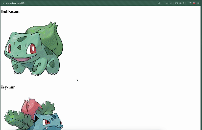
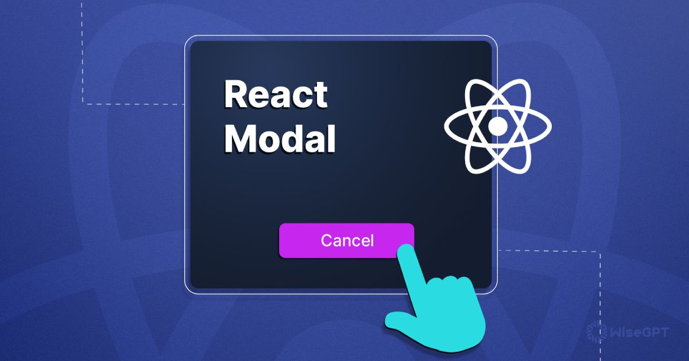

# Course Checkpoint 18

## ¿Qué es un Scroll Infinito?


Infinite Scrolling es un método popular para cargar datos según sea necesario (quests on-demand). En este paradigma, en el renderizado inicial, la aplicación sólo solicita una parte del contenido (sólo el que podrá ver) y dinámicamente trampa las siguientes partes a medida que el usuario desplaza la página, proporcionando una experiencia de usuario sin fisuras.

### Biblioteca de Hooks React

Reactuse es la mayor colección de hooks para React. Para llevar a cabo la idea de ella necesitará 2 hoka:

1. useQuery - para crear solicitudes de servidor
2. useIntersectionObserver - para realizar un seguimiento de la ubicación del DOM del elemento en el campo de visibilidad del usuario

Para la instalación:

```
npm i @siberiacancode/reactuse --save
```

### API falsa

Para la demostración utilizaré el mock api - https ://pokeapi.co/

La solicitud https://pokeapi.co/api/v2/pokemon/?limit=5&offset=0 dará los primeros 5 Pokémon.

### Implementación de Infinite Scroll

creamos una constante de PORTION_OF_ITEMS que significará el número de Pokémon que regresará en una sola solicitud. (PORTION_OF_ITEMS = límite en la solicitud)

```JavaScript
const PORTION_OF_ITEMS = 4;

function App() {}
```

Creamos un estado offset en el que se almacenará el cambio de búsqueda de Pokémon (cambiaremos a una cantidad igual a PORTION_OF_ITEMS)

```JavaScript
const [offset, setOffset] = useState<number>(0);
```

Importar hooks de reactuse

```JavaScript
import { useIntersectionObserver, useQuery } from "@siberiacancode/reactuse";
```

Creamos una consulta con useQuery. En la función callback especificamos el fetch normal a petición de nuestra api. (Importante: en el objeto options, el hook useQuery especifica keys: [offset], es necesario que la solicitud se envíe de nuevo si actualizamos el estado offset). También creamos pokemons state.

En caso de éxito (onSuccess), vamos a la matriz de pokemons y pokémon anteriores, y recién solicitado.

Obtenemos un conjunto de states: data, isLoading, isError, isSuccess, error.

```JavaScript
const [pokemons, setPokemons] = useState<Pokemon[]>([]);

  const { isLoading, isError, isSuccess, error } = useQuery(
    () =>
      fetch(
        `https://pokeapi.co/api/v2/pokemon/?limit=${PORTION_OF_ITEMS}&offset=${offset}`
      )
        .then((res) => res.json())
        .then((res) => res.results as Promise<Pokemon[]>),
    {
      keys: [offset],
      onSuccess: (fetchedPokemons) => {
        setPokemons((prevPokemons) => [...prevPokemons, ...fetchedPokemons]);
      },
    }
  );
```

En el caso de isError, mostramos un mensaje de error. Si isLoading muestra «Pending...»

Si todo está bien (isSuccess), entonces use el método map () en la matriz de la variable pokemons para mostrar todos los Pokémon.

Después de la lista de Pokémon añadiremos «Loading new»..., a continuación nos referiremos a ella. Si aparece en el campo de visibilidad, los datos se cargarán.

```JavaScript
  if (isError)
    return (
      <div>
        {error?.name}: {error?.message}
      </div>
    );

  if (isLoading) return <div>Pending...</div>;

  if (isSuccess)
    return (
      <div>
        {pokemons.map((pokemon, index) => {
          return (
            <div key={index} className=" w-32 h-32">
              <h1>{pokemon.name}</h1>
              
            </div>
          );
        })}
        <div>Loading new...</div>
      </div>
    );
```

```JavaScript
interface Pokemon {
  name: string;
}
```

Ahora agregaremos useIntersectionObserver

Aquí obtenemos un ref que untaremos un elemento con el texto «Loading»... para que cuando aparezca en el campo de visibilidad, la aplicación procese inmediatamente la siguiente consulta.

en el método onChange, comprobamos si se produce una intersección. Si es así, movemos el state offset a un valor igual a PORTION_OF_ITEMS. (dado que previamente pasamos offset a keys, el parámetro hook useQuery, la nueva solicitud se enviará inmediatamente a medida que el estado offset se actualiza)

```JavaScript
const { ref } = useIntersectionObserver<HTMLDivElement>({
    threshold: 1,
    onChange: (entry) => {
      if (entry.isIntersecting) setOffset((prev) => prev + PORTION_OF_ITEMS);
    },
  });
```

```JavaScript
<div ref={ref}>Loading...</div>
```

### Ahora todo está listo



### Código completo

```JavaScript
import { useIntersectionObserver, useQuery } from "@siberiacancode/reactuse";
import { useState } from "react";

const PORTION_OF_ITEMS = 4;

interface Pokemon {
  name: string;
}

function App() {
  const [offset, setOffset] = useState<number>(0);
  const [pokemons, setPokemons] = useState<Pokemon[]>([]);

  const { isLoading, isError, isSuccess, error } = useQuery(
    () =>
      fetch(
        `https://pokeapi.co/api/v2/pokemon/?limit=${PORTION_OF_ITEMS}&offset=${offset}`
      )
        .then((res) => res.json())
        .then((res) => res.results as Promise<Pokemon[]>),
    {
      keys: [offset],
      onSuccess: (fetchedPokemons) => {
        setPokemons((prevPokemons) => [...prevPokemons, ...fetchedPokemons]);
      },
    }
  );

  const { ref } = useIntersectionObserver<HTMLDivElement>({
    threshold: 1,
    onChange: (entry) => {
      if (entry.isIntersecting) setOffset((prev) => prev + PORTION_OF_ITEMS);
    },
  });

  if (isError)
    return (
      <div>
        {error?.name}: {error?.message}
      </div>
    );

  if (isLoading && !pokemons.length) return <div>Pending...</div>;

  if (isSuccess)
    return (
      <div>
        {pokemons.map((pokemon, index) => {
          return (
            <div key={index} className=" w-32 h-32">
              <h1>{pokemon.name}</h1>
              
            </div>
          );
        })}
        <div ref={ref}>Loading...</div>
      </div>
    );
}

export default App;
```

## ¿Qué es un modal?



### react-modal

#### instalación

Para instalar la versión estable puede utilizar npm:

```
npm install react-modal
```

Para instalar react-modal en la aplicación React CDN:

- Agregue esta etiqueta de script CDN después de los scripts CDN de React y antes de los archivos JS (por ejemplo, de cdnjs):

```HTML
    <script src="https://cdnjs.cloudflare.com/ajax/libs/react-modal/3.14.3/react-modal.min.js"
    integrity="sha512-MY2jfK3DBnVzdS2V8MXo5lRtr0mNRroUI9hoLVv2/yL3vrJTam3VzASuKQ96fLEpyYIT4a8o7YgtUs5lPjiLVQ=="
    crossorigin="anonymous"
    referrerpolicy="no-referrer"></script>
```

- Usa la etiqueta < ReactModal > dentro de tu aplicación React CDN.

#### Uso general

El único accesorio necesario para el objeto modal es isOpen, que indica si se debe mostrar el modal. El siguiente es un ejemplo del uso de react-modal especificando todos los apoyos y opciones posibles:

```JavaScript
import ReactModal from 'react-modal';

<ReactModal

  isOpen={
    false
  /* Boolean describing if the modal should be shown or not. */}

  onAfterOpen={
    handleAfterOpenFunc
  /* Function that will be run after the modal has opened. */}

  onAfterClose={
    handleAfterCloseFunc
  /* Function that will be run after the modal has closed. */}

  onRequestClose={
    handleRequestCloseFunc
  /* Function that will be run when the modal is requested
     to be closed (either by clicking on overlay or pressing ESC).
     Note: It is not called if isOpen is changed by other means. */}

  closeTimeoutMS={
    0
  /* Number indicating the milliseconds to wait before closing
     the modal. */}

  style={
    { overlay: {}, content: {} }
  /* Object indicating styles to be used for the modal.
     It has two keys, `overlay` and `content`.
     See the `Styles` section for more details. */}

  contentLabel={
    "Example Modal"
  /* String indicating how the content container should be announced
     to screenreaders */}

  portalClassName={
    "ReactModalPortal"
  /* String className to be applied to the portal.
     See the `Styles` section for more details. */}

  overlayClassName={
    "ReactModal__Overlay"
  /* String className to be applied to the overlay.
     See the `Styles` section for more details. */}

  id={
    "some-id"
  /* String id to be applied to the content div. */}

  className={
    "ReactModal__Content"
  /* String className to be applied to the modal content.
     See the `Styles` section for more details. */}

  bodyOpenClassName={
    "ReactModal__Body--open"
  /* String className to be applied to the modal ownerDocument.body
     (must be a constant string).
     This attribute when set as `null` doesn't add any class
     to document.body.
     See the `Styles` section for more details. */}

  htmlOpenClassName={
    "ReactModal__Html--open"
  /* String className to be applied to the modal ownerDocument.html
     (must be a constant string).
     This attribute is `null` by default.
     See the `Styles` section for more details. */}

  ariaHideApp={
    true
  /* Boolean indicating if the appElement should be hidden */}

  shouldFocusAfterRender={
    true
  /* Boolean indicating if the modal should be focused after render. */}

  shouldCloseOnOverlayClick={
    true
  /* Boolean indicating if the overlay should close the modal */}

  shouldCloseOnEsc={
    true
  /* Boolean indicating if pressing the esc key should close the modal
     Note: By disabling the esc key from closing the modal
     you may introduce an accessibility issue. */}

  shouldReturnFocusAfterClose={
    true
  /* Boolean indicating if the modal should restore focus to the element
     that had focus prior to its display. */}

  role={
    "dialog"
  /* String indicating the role of the modal, allowing the 'dialog' role
     to be applied if desired.
     This attribute is `dialog` by default. */}

  preventScroll={
    false
  /* Boolean indicating if the modal should use the preventScroll flag when
     restoring focus to the element that had focus prior to its display. */}

  parentSelector={
    () => document.body
  /* Function that will be called to get the parent element
     that the modal will be attached to. */}

  aria={
    {
      labelledby: "heading",
      describedby: "full_description"
    }
  /* Additional aria attributes (optional). */}

  data={
    { background: "green" }
  /* Additional data attributes (optional). */}

  testId={
    ""
  /* String testId that renders a data-testid attribute in the DOM,
    useful for testing. */}

  overlayRef={
    setOverlayRef
  /* Overlay ref callback. */}

  contentRef={
    setContentRef
  /* Content ref callback. */}

  overlayElement={
    (props, contentElement) => <div {...props}>{contentElement}</div>
  /* Custom Overlay element. */}

  contentElement={
    (props, children) => <div {...props}>{children}</div>
  /* Custom Content element. */}
  >
    <p>Modal Content</p>
</ReactModal>
```

#### Uso de un nodo primario personalizado

De forma predeterminada, el portal modal se anexará al cuerpo del documento. Puede elegir un elemento padre diferente proporcionando una función a la prop parentSelector que devuelve el elemento que se va a utilizar:

```JavaScript
<Modal
  ...
  parentSelector={() => document.querySelector('#root')}>
  <p>Modal Content.</p>
</Modal>
```

Si haces esto, asegúrate de que el elemento de tu aplicación esté configurado correctamente. El elemento de aplicación no debe ser un padre del modal, para evitar que el contenido modal se oculte a los lectores de pantalla mientras está abierto.

#### Recomendaciones

Puede utilizar devoluciones de llamada ref para obtener directamente los nodos DOM de superposición y contenido:

```JavaScript
<Modal
  ...
  overlayRef={node => (this.overlayRef = node)}
  contentRef={node => (this.contentRef = node)}>
  <p>Modal Content.</p>
</Modal>
```

### Ejemplo

```JavaScript
import React from 'react';
import ReactDOM from 'react-dom';
import Modal from 'react-modal';

const customStyles = {
  content: {
    top: '50%',
    left: '50%',
    right: 'auto',
    bottom: 'auto',
    marginRight: '-50%',
    transform: 'translate(-50%, -50%)',
  },
};

// Make sure to bind modal to your appElement (https://reactcommunity.org/react-modal/accessibility/)
Modal.setAppElement('#yourAppElement');

function App() {
  let subtitle;
  const [modalIsOpen, setIsOpen] = React.useState(false);

  function openModal() {
    setIsOpen(true);
  }

  function afterOpenModal() {
    // references are now sync'd and can be accessed.
    subtitle.style.color = '#f00';
  }

  function closeModal() {
    setIsOpen(false);
  }

  return (
    <div>
      <button onClick={openModal}>Open Modal</button>
      <Modal
        isOpen={modalIsOpen}
        onAfterOpen={afterOpenModal}
        onRequestClose={closeModal}
        style={customStyles}
        contentLabel="Example Modal"
      >
        <h2 ref={(_subtitle) => (subtitle = _subtitle)}>Hello</h2>
        <button onClick={closeModal}>close</button>
        <div>I am a modal</div>
        <form>
          <input />
          <button>tab navigation</button>
          <button>stays</button>
          <button>inside</button>
          <button>the modal</button>
        </form>
      </Modal>
    </div>
  );
}

ReactDOM.render(<App />, appElement);
```
